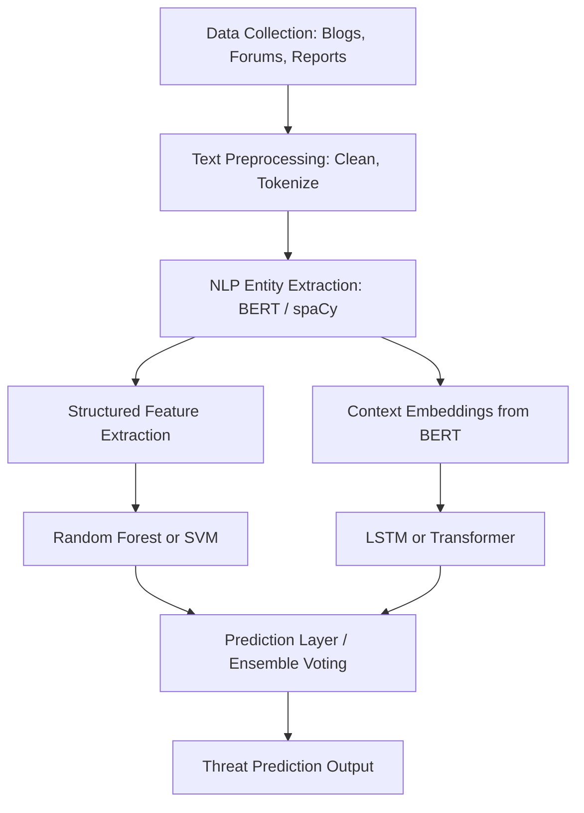

# Cyber-Threat-Intelligence-System-Using-NLP
AI-Based Predictive Cyber Threat  Intelligence System Using Natural Language  Processing (NLP)

## **Literature Review**

A literature review presents an overview of existing work in the field. Here’s how to frame it:

### 1. **Cyber Threat Intelligence (CTI)**

* CTI refers to the collection and analysis of information about current and potential cyber threats.
* According to [MITRE ATT\&CK](https://attack.mitre.org/), understanding attacker tactics, techniques, and procedures (TTPs) is key to threat prediction.

### 2. **Use of NLP in CTI**

* Researchers like Mittal et al. (2020) and Sabottke et al. (2015) have explored NLP to extract threat indicators from unstructured data (e.g., blogs, forums, threat reports).
* NLP models like BERT, spaCy, and GPT are used for Named Entity Recognition (NER) to detect Indicators of Compromise (IOCs) such as IPs, domains, malware names.

### 3. **Predictive Models in Cybersecurity**

* Machine learning models (Random Forest, SVM, LSTM) and deep learning architectures (Transformers, RNNs) are used to predict attacks based on patterns and threat data.
* Predictive threat models trained on historical CTI datasets (e.g., APT reports) can anticipate future threat vectors.

### 4. **Challenges**

* The major challenges include data quality, multilingual sources, domain-specific jargon, and evolving threat landscapes.
* Real-time processing and false positives remain critical limitations.

## **Objectives**

1. **To design and implement an NLP-driven system for extracting actionable intelligence from unstructured threat data sources.**
2. **To identify and classify Indicators of Compromise (IoCs) from online forums, blogs, and reports.**
3. **To build a predictive model that forecasts future cyber threats based on historical data.**
4. **To automate threat trend analysis for aiding proactive cybersecurity measures.**
5. **To evaluate the system using real-world CTI datasets for accuracy, precision, recall, and F1 score.**

## **Methodology**

Here’s a high-level methodology you can adapt and elaborate on based on your tools and datasets:

### Step 1: **Data Collection**

* Sources: Blogs (e.g., KrebsOnSecurity), Twitter (threat actors), dark web forums, open CTI datasets (like MISP, Hail-a-TAXII, AlienVault OTX).
* Format: JSON, HTML, text documents.

### Step 2: **Preprocessing**

* Clean text: remove stopwords, normalize case, tokenize.
* Language detection and translation if sources are multilingual.
* Annotate and label threat entities (IP, hash, CVE, malware names).

### Step 3: **NLP Pipeline**

* Use **spaCy / NLTK / BERT** for:

  * Named Entity Recognition (NER)
  * Relationship extraction (e.g., malware ↔ exploit)
* Perform **topic modeling** (LDA) to find emerging trends.

### Step 4: **Threat Prediction Model**

* Train ML models (Random Forest, LSTM, or Transformer-based models) on structured CTI data.
* Input features: IoC frequency, relation networks, threat actor behavior.
* Output: Probability of future threat types or affected sectors.

### Step 5: **Visualization & Dashboard**

* Use tools like **Plotly, Dash, or Streamlit** to display:

  * Real-time threat maps
  * Entity relations (graph-based)
  * Predictive threat alerts

### Step 6: **Evaluation**

* Use metrics like Accuracy, Precision, Recall, F1 Score.
* Compare different ML/NLP model performances.

##  **Combine ML & DL for Predictive Cyber Threat Intelligence with NLP?**

| Aspect                       | ML Models                                                   | DL Architectures                                | Combo Power 💥                                                   |
| ---------------------------- | ----------------------------------------------------------- | ----------------------------------------------- | ---------------------------------------------------------------- |
| **Speed & Interpretability** | Logistic Regression, Random Forest (fast and interpretable) | LSTM, Transformers (capture complex patterns)   | Use ML for quick predictions and DL for deep contextual analysis |
| **Structured Data**          | Great at handling tabular CTI datasets                      | Not ideal alone for structured data             | Combine ML on structured features + DL on text                   |
| **Text Understanding**       | TF-IDF + ML models (shallow understanding)                  | Transformers/BERT (deep semantic understanding) | Use DL for text + ML for final threat prediction                 |
| **Ensemble Learning**        | Easy with ML (e.g., stacking, voting)                       | Harder but possible with DL                     | ML ensemble with DL outputs boosts performance                   |

---

## **Combining ML & DL in our Project**

### **Pipeline Structure Example**

---

## **Practical Implementation Idea**

### 1. **Text to Features (DL side)**

* Use **BERT** or **DistilBERT** to convert threat reports into embeddings.
* These embeddings capture the **semantic meaning** of threat terms.

### 2. **Text to Entities (NLP side)**

* Use **Named Entity Recognition (spaCy, fine-tuned BERT)** to extract:

  * IPs
  * Malware names
  * Threat actor groups
  * Vulnerabilities (CVEs)

### 3. **Tabular Features (ML side)**

* Count-based features:

  * Frequency of terms (e.g., how often "ransomware" appears)
  * Source trust score
  * Threat level (labeled)
* Feed these into traditional ML models like **Random Forest**, **XGBoost**, or **SVM**.

### 4. **Ensemble Strategy**

* **Option 1:** Combine the predictions of ML and DL models via a **voting or averaging layer**.
* **Option 2:** Use ML models on **DL outputs (embeddings)** + other metadata.

---

## Suggested Combo Framework

| Component         | Tool / Model                       |
| ----------------- | ---------------------------------- |
| Preprocessing     | NLTK / spaCy                       |
| Embedding Layer   | BERT / RoBERTa (from Hugging Face) |
| DL Classifier     | BiLSTM / Transformer               |
| Feature Extractor | CountVectorizer, TF-IDF            |
| ML Classifier     | Random Forest / XGBoost            |
| Ensemble Layer    | VotingClassifier / Custom Layer    |

---

## Example Use Case:

| Task                        | Tool/Model                         |
| --------------------------- | ---------------------------------- |
| Extract IOCs from reports   | spaCy NER or fine-tuned BERT       |
| Convert text into vectors   | BERT embeddings                    |
| Predict malware family      | LSTM classifier on embeddings      |
| Use source credibility info | Random Forest on metadata + labels |
| Combine final predictions   | VotingClassifier (Scikit-learn)    |

---

## Tools & Libraries to Combine Them

* `scikit-learn`: For ML models and ensemble methods.
* `transformers` (Hugging Face): For DL language models like BERT.
* `tensorflow` / `pytorch`: For building and training DL models.
* `xgboost`: Advanced gradient boosting ML model.
* `streamlit` or `Flask`: For building the final UI or dashboard.

---

## **Tools & Technologies You Can Use**

* **NLP:** spaCy, Hugging Face Transformers, BERT, GPT-4, NLTK
* **ML/DL:** Scikit-learn, TensorFlow, PyTorch
* **Visualization:** Matplotlib, Seaborn, Plotly, Streamlit
* **Datasets:** MISP Threat Intelligence, CVD lists, OTX feeds, MITRE ATT\&CK JSON
* **Others:** MongoDB for storage, Flask/Django for web interface

---

Would you like help with:

* The detailed implementation plan?
* Python code snippets for parts of this?
* PPT or report formats?

Let me know what you need next 🚀

