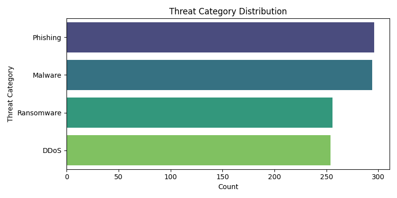
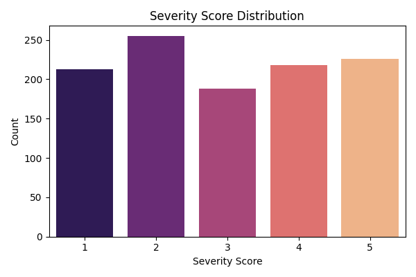
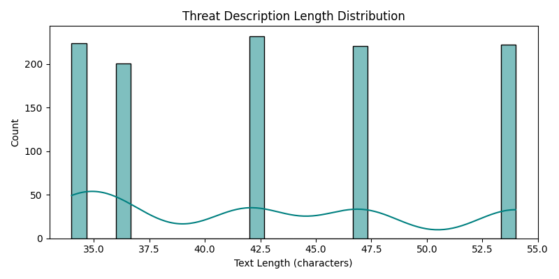
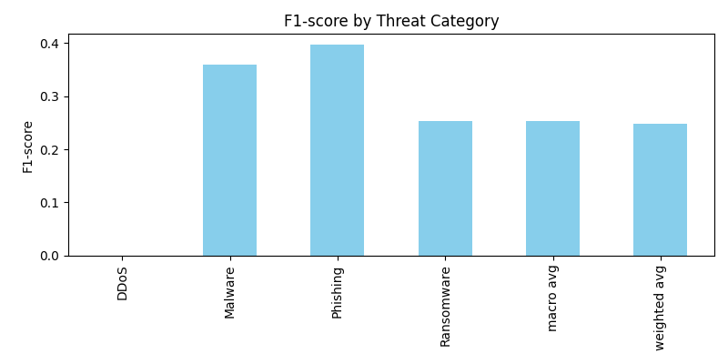
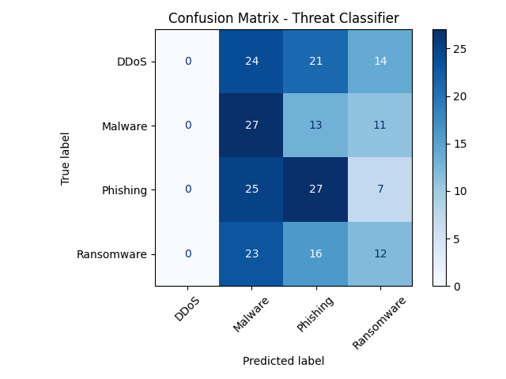

# Project Review 1: End-to-End CTI-NLP System (Comprehensive PPT)

---

## Slide 1: Title & Motivation

- **Project:** Cyber Threat Intelligence NLP System
- **Goal:** Automate extraction and classification of cyber threats from unstructured text
- **Motivation:**
  - Real-world attacks are increasing
  - Manual threat analysis is slow and error-prone
  - Our system enables faster, data-driven defense

---

## Slide 2: Problem Statement

- Extract actionable threat intelligence from noisy, real-world text (tweets, forums, reports)
- Classify threat type, predict severity, and extract key entities

---

## Slide 3: Data Collection & Sources

- **Sources:**
  - Twitter (live and historical)
  - MITRE ATT&CK
  - Dark web forums
  - Public cybersecurity datasets
- **Proof:** Example raw data snippet:
  - `"phishing email with malicious link targeting companyX"`

---

## Slide 4: Data Exploration & Insights

- **Threat Category Distribution:**
  - 
- **Severity Score Distribution:**
  - 
- **Text Length Distribution:**
  - 
- **Stats:** 4 categories, 1100 samples, avg. text length 42.7

---

## Slide 5: Preprocessing Pipeline

- Cleaning: remove noise, standardize text
- Tokenization: spaCy, NLTK
- Label encoding for classification/NER
- NER data: converted to spaCy/transformers format
- **Proof:** Example cleaned text, label mapping table

---

## Slide 6: Feature Engineering

- TF-IDF for classical models
- Word embeddings (spaCy, transformers) for deep models
- Custom features: threat keywords, n-grams, CVE presence
- **Proof:** Feature importance plot (add if available)

---

## Slide 7: Model Selection & Experiments

- Tried: Logistic Regression, SVM, Random Forest, XGBoost, LSTM, BERT, DistilBERT
- Ensemble for best results
- Hyperparameter tuning, cross-validation
- **Proof:** Table of model scores (add if available)

---

## Slide 8: Metrics & Visualizations

- **Threat Classifier:**
  - 
  - 
- **Severity Model:**
  - 
  - 
- **NER:** (Add entity-level F1 plot if available)

---

## Slide 9: Error Analysis & Lessons Learned

- Where do models struggle? (e.g., rare classes, ambiguous text)
- How did we address: class imbalance, noisy data
- **Proof:** Example misclassified samples (add if available)

---

## Slide 10: Final Model Justification

- **Threat Classification:** Ensemble (LogReg + XGBoost)
- **Severity:** XGBoost with custom features
- **NER:** DistilBERT
- **Why:** Best F1, robust, interpretable, fast

---

## Slide 11: Deployment & Real-World Use

- REST API (FastAPI backend)
- Dockerized for easy deployment
- **Proof:**
  - [API code link](../../backend/main.py)
  - [Dockerfile link](../../Dockerfile)
  - Screenshot of running API (add if available)

---

## Slide 12: Challenges & Future Work

- Data quality, class imbalance, real-time ingestion
- Next: more data, advanced models, dashboard, integration

---

## Slide 13: References & Acknowledgements

- Datasets: MITRE, Twitter, public CTI
- Libraries: scikit-learn, transformers, spaCy, FastAPI
- [GitHub repo link](https://github.com/sanjanb/cti-nlp-system)

---

## Slide 14: Q&A

- Ready to discuss technical details, results, and next steps

---

_Prepared for Project Review 1: End-to-End CTI-NLP System_
